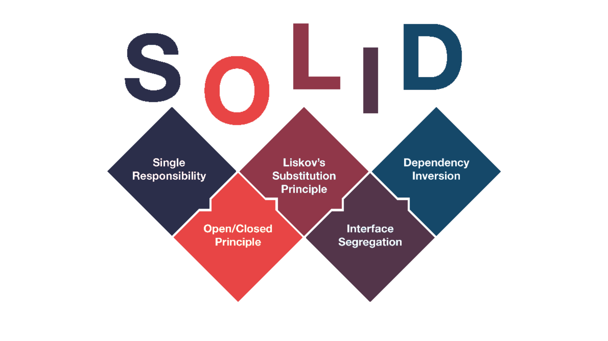
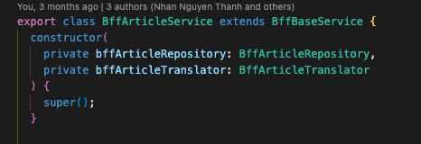
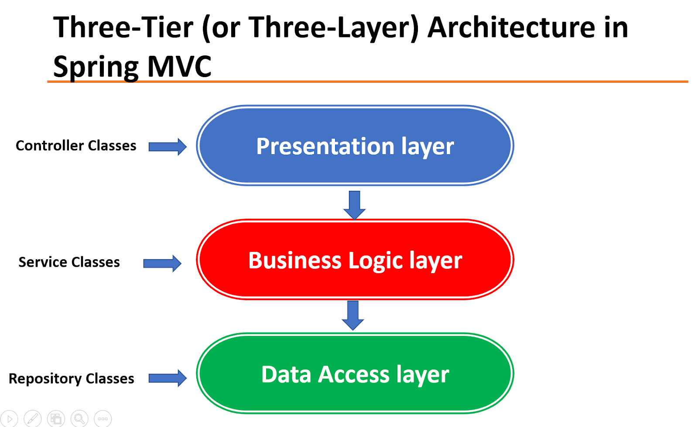
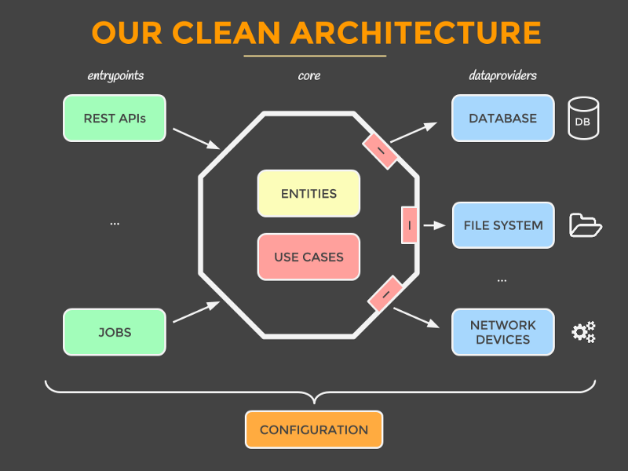

# Clean Architecture

## Solid

### Dependency Inversion vs Dependency Injection vs Inversion of Control

- Dependency Inversion (DIP)
    - Principle
        - High-level modules should not depend on lower-level modules. Both should depend on abstractions.
        - Abstractions should not depend on details. Details should depend on abstractions.

- Inversion of Control (IoC)
    - Principle
        - Transfers the control of objects of a program to container to a container or framework.

- Dependency Injection
    - Pattern
        - an object or function receives other objects or functions that it requires
        - 

## What is Clean Architecture

### 3 Layers Architecture

### Clean Architecture

